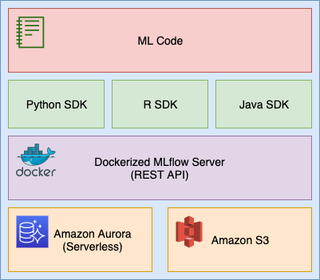

# Tracking and collaboration on ML Experiments using MLFlow, ECR, Docker, S3 and Aurora

**Author: Iman Kamyabi**

## Introduction

Mlflow is an open source framework for managing machine learning projects lifecycle. By default, it persists metadata and artifacts associated with ML experiments locally. In order to collaborate on those experients and to avoid loosing any local data you need to configure a remote backend and artifact storage. 

In this article I will explain how to create an Mlflow Tracking Server using Amazon S3 as the artifact store and Amazon Aurora Serverless as the backend store.

## MLflow Components:

The following lists the 3 main mlflow functions:

- **Tracking Experiments** 
Logging code versions, parameters, metrics and outputs when running ml code. (ML Governance)

- **Packaging ML Projects**
Standardize packaging Data Science projects by conventions so it's organized, reusable and reproducable

- **Packaging ML models**
Standardize packaging different 'flavors' of ml models and makes it consumable through Rest API and Python libraries

## Tracking MLFlow on local file disk
In the following I will demonstrate basic use of mlflow by using local file disk for persisting metadata and artifacts. Later I will show how to change this to AWS-Backed infrastructure so we can collaborate on experiments and avoid losing data.


### Set Up Workspace
In this step we will create an mlflow project, add a sample script and run an experiment.

#### Install mlflow:

Run the following command to install mlflow using Python 3:

```bash
pip3 install mlflow
```

Create a new directory 'mlflow-aws' and navigate to that directory.
```bash
mkdir mlflow-aws
```
```bash
cd mlflow-aws
```


Create a new file 'tracking.py':

```python
import os
from random import random, randint

from mlflow import log_metric, log_param, log_artifacts

if __name__ == "__main__":
    print("Running mlflow_tracking.py")

    log_param("param1", randint(0, 100))
    
    log_metric("foo", random())
    log_metric("foo", random() + 1)
    log_metric("foo", random() + 2)

    if not os.path.exists("outputs"):
        os.makedirs("outputs")
    with open("outputs/test.txt", "w") as f:
        f.write("hello world!")

    log_artifacts("outputs")

```

before we run the script let's go over some of the Mlflow APIs used in the script above. 'log_param' is used to log a specific parameters are string key value pairs and can be used to store configurations such as HyperParameters. 'log_metric' logs a metric. Metrics are numbers than can be updated. (for example during each iteration of an ml model training). 'log_artifact' persist an artifact (such as model artifact or images).


Now run the python script:

```bash
python3 tracking.py
```

When running the above script mlflow stores metadata and artifacts locally with a similar directory structure as following:

```
├── mlruns
│   └── 0
│       ├── 87baf228b4494cbead68274107a19809
│       │   ├── artifacts
│       │   │   └── test.txt
│       │   ├── meta.yaml
│       │   ├── metrics
│       │   │   └── foo
│       │   ├── params
│       │   │   └── param1
│       │   └── tags
│       │       ├── mlflow.source.name
│       │       ├── mlflow.source.type
│       │       └── mlflow.user
│       └── meta.yaml
├── outputs
│   └── test.txt
└── tracking.py
```

Now that we got it working locally let's set up a cloud metadata (for storing params, metrics, and tags for runs) and artifact storage (for storing model artifacts) backed by AWS.

## Architecture

The following diagram shows a layered view of the architecture we will be using.



#### Backend Storage (Aurora)
Backend Storage is used to store  parameters, metrics, and tags for runs.

Backend storage can be file-based or backed by a databse with  SQLAlchemy URL. 

Here we use a database and utilize AWS Aurora Serverless to spin up our RDS cluster as a database is a better option to query these metadatas at scale.

#### Artifact Storage (S3)
For storing artifacts there are couple of options. It can be stored locally or on Amazon S3, Azure Blob, Google Cloud Storage, FTP Server, SFTP Server, NFS or HDFS.

Here we use Amazon S3 as a managed object storage service to store the artifacts.

#### Mlflow Server (Docker)
As the name implies, mlflow server starts a web server that acts as an API layer between the client python code and the backend storage.

This server can be ran locally, remotely (in a EC2 instance for example) or locally inside a docker container. Here we use a local docker container as 1- The server itself doesn't contain any state data (we store them on S3 and Aurora database) so there is no need to run it remotely and 2- Running docker helps us to run a containerized version of mlflow and all of it's runtime dependencies instead of installing all those. 


## Deploy MLFlow Infrastructure on AWS

1- Verify AWS CLI is installed on your system. The following command will confirm if it's installed:
```sh
aws --version
```
If not installed refere to [this link](https://docs.aws.amazon.com/cli/latest/userguide/install-cliv2.html) for the instructions.

2- Verify mysql is installed on our system by running the following command:
```sh
mysql --version
```
If not installed, for MacOS it can be instaled using ```brew```.:
```sh
brew install mysql
```
If don't have brew installed it can be installed via the following command:
```sh
/usr/bin/ruby -e "$(curl -fsSL https://raw.githubusercontent.com/Homebrew/install/master/install)"
```

For other operating systems refer to [this link](https://dev.mysql.com/doc/mysql-getting-started/en/#mysql-getting-started-installing) for instructions.

3- Create an S3 bucket used for deploying cloudformation. This bucket will be used by cloudformation for uploading the template files during deployment of the stack. We call this bucket "cloudformation bucket" from now on:
```sh
aws s3api create-bucket --bucket <bucket-name> --region <region>
```

**Note:**
Make sure your 'aws cli' is configured and your credentials is set. You can verify that by viewing content of ```~/.aws/credentials``` file. If not configured you can configure that by running the following command:
```sh
aws configure
```

4- Deploy CloudFormation template. This step will deploy a cloudformation template that containes all resources used by MLFlow server.

```sh
./scripts/01_deploy-cf.sh <stack name> <cloudformation bucket> <database name> <database instance type> <database username> <database password>
```

**Notes**
- *database instance type* should be one of the allowed values for the database. [Here](https://aws.amazon.com/rds/aurora/pricing/) you can find the documentation for that.
- *database name* should be unique per account.

Deployment takes around 10 minutes.

Once done you can check the following *outputs* in the output tab of the deployed stack in AWS console. The value for these outputs will be used in the next steps.
- **ArtifactRoot**: The S3 path for the bucket that will be used for mlflow artifacts.
- **DatabaseEndpoint**: The RDS database endpoint that will be used for persisting MLFlow metadata
- **DatabaseUsername**: The database username
- **DatabasePassword**: The database password
- **DatabasePort**: The database port
- **DatabaseUrl**: The database URL in the SQL Alchemy format

5- Create a new project. This step will create a new schema in the database to be used for the new project.
```sh
./scripts/02_create-project.sh <output DatabaseUsername> <output DatabaseEndpoint> <project name>
```
After running the above command enter the database password when prompted.


6- Create an ECR repository. This repository will be used later to host the docker image for mlflow server:
```sh
./scripts/03_create-ecr-repo.sh <repository name>
```
**Note:**
The above command will check if the repository exists and only creates it if not exist.

7- Build and tag the docker image:
```sh
./scripts/04_build-image.sh <repository name> <region>
```

8- Push the docker image to ECR:
```sh
05_push-image.sh <Repository name> <Region>
```

## Run MLFlow server locally
Once installed the mlflow backend by the above steps now it can be ran by multiple people as long as they have access to the AWS resources (for example for uploading artifacts to S3) and the stack output values such as db username and password.

This command will run a docker container locally with mlflow server configured to connect to your backend infrastructure on AWS:

```sh
./scripts/run-server.sh <output DatabaseUrl> <output ArtifactRoot> <AWS Access Key ID> <AWS Secret Access Key> <Port> <Repository name> <Project name> <Region>
```

Now MLflow dashboard is accessible through ```localhost:<Port>``` in the browser and it uses the backend infrastructure on AWS for tracking metadata and uploading artifacts.

## Create a new project
A new project is a new instance of mlflow server with it's own database schema and artifact path. This allows collaboration on a per project basis and can create new projects on the same AWS infrastructure.

To create a new project run the following command:
```sh
./scripts/02_create-project.sh <output DatabaseUsername> <output DatabaseEndpoint> <project name>
```

The above command will create a new schema in the existing database for the new project.

Now you can run MLFlow server locally pointing to the new project:
```sh
./scripts/run-server.sh <output DatabaseUrl> <output ArtifactRoot> <AWS Access Key ID> <AWS Secret Access Key> <Port> <Repository name> <Project name> <Region>
```

Each project has it's own sub directory in the S3 artifacts bucket.